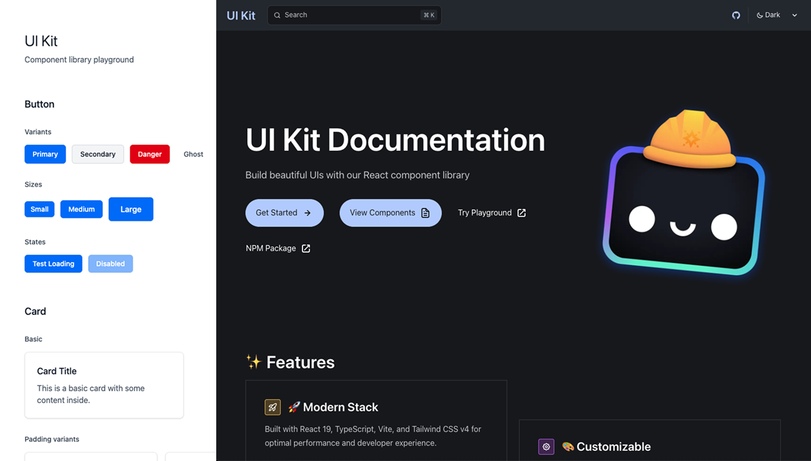

# UI Kit Monorepo



A modern React component library with **40+ components** built with TypeScript, Vite, and Tailwind CSS v4, organized as a monorepo for better development experience and scalability.

[](https://www.npmjs.com/package/@creativoma/ui-kit)
[](https://github.com/creativoma/ui-kit/actions)

## 🚀 Quick Links

- 📦 **NPM Package**: [@creativoma/ui-kit](https://www.npmjs.com/package/@creativoma/ui-kit)
- 🎮 **Live Demo**: [ui-kit-playground.vercel.app](https://ui-kit-playground.vercel.app/)
- 📚 **Documentation**: [ui-kit-docs-mu.vercel.app](https://ui-kit-docs-mu.vercel.app/)
- 📋 **Changelog**: [CHANGELOG.md](./CHANGELOG.md)

## ✨ Features

- **40+ Components**: Comprehensive set of UI components based on shadcn/ui patterns
- **Tailwind CSS v4**: Built with the latest Tailwind CSS version
- **TypeScript**: Full type safety and IntelliSense support
- **React 19**: Compatible with the latest React version
- **Accessible**: Components follow WAI-ARIA guidelines
- **Customizable**: Easy to customize with Tailwind classes

## 📁 Project Structure

```
ui-kit/
├── apps/
│   └── website/      # Component demos & example pages
├── packages/
│   └── ui/           # Main UI Kit library (40+ components)
└── ...
```

## 🧩 Components

The library includes components for:

- **Layout**: Accordion, AspectRatio, Card, Collapsible, Resizable, ScrollArea, Separator, Sidebar
- **Forms**: Button, ButtonGroup, Checkbox, Field, Form, Input, InputGroup, InputOTP, Label, RadioGroup, Select, Slider, Switch, Textarea, Toggle, ToggleGroup
- **Feedback**: Alert, AlertDialog, Dialog, Drawer, Empty, Progress, Sheet, Skeleton, Sonner, Spinner, Tooltip
- **Navigation**: Breadcrumb, Command, ContextMenu, DropdownMenu, HoverCard, Menubar, NavigationMenu, Pagination, Popover, Tabs
- **Data Display**: Avatar, Badge, Calendar, Carousel, Chart, Kbd, Table

## 🛠️ Development

### Prerequisites

- Node.js 22+
- pnpm 10.6.2+

### Getting Started

```bash
# Clone the repository
git clone https://github.com/creativoma/ui-kit.git
cd ui-kit

# Install dependencies
pnpm install

# Start development servers
pnpm dev
```

### Available Commands

```bash
# Development
pnpm dev          # Start all apps in development mode
pnpm build        # Build all packages and apps
pnpm lint         # Lint all packages
pnpm type-check   # Type check all packages
pnpm format       # Format code with Prettier

# Package-specific
pnpm dev --filter=website              # Start only website
pnpm build --filter=@creativoma/ui-kit # Build only UI Kit
```

## 📦 Packages

### [@creativoma/ui-kit](./packages/ui)
The main UI component library with 40+ components including Button, Card, Dialog, Form, and more.

## 🚀 Apps

### [Website](./apps/website)
Interactive demos and example landing pages showcasing all components.

## 📋 Changelog

See [CHANGELOG.md](./CHANGELOG.md) for a list of changes.

## 🤝 Contributing

1. Fork the repository
2. Create your feature branch (`git checkout -b feat/amazing-feature`)
3. Commit your changes (`git commit -m 'Add amazing feature'`)
4. Push to the branch (`git push origin feat/amazing-feature`)
5. Open a Pull Request

## 📄 License

MIT License - see [LICENSE](LICENSE) for details.